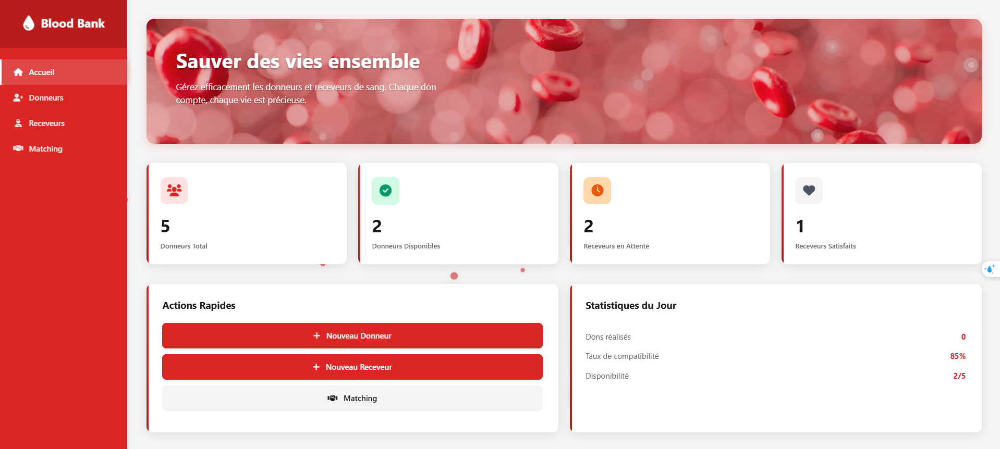
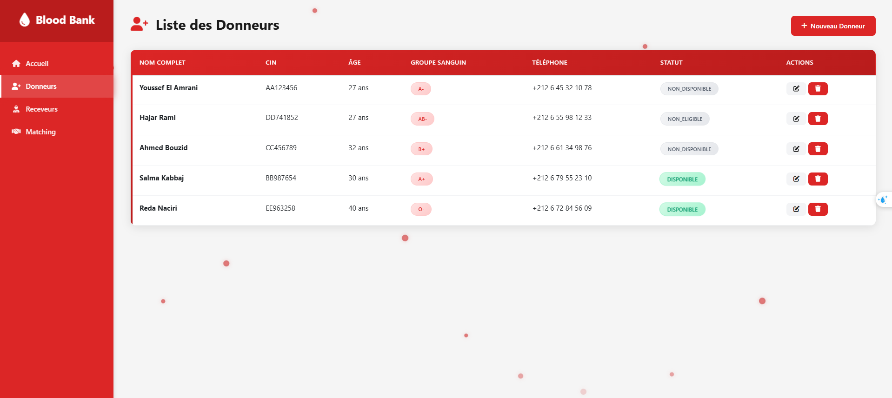
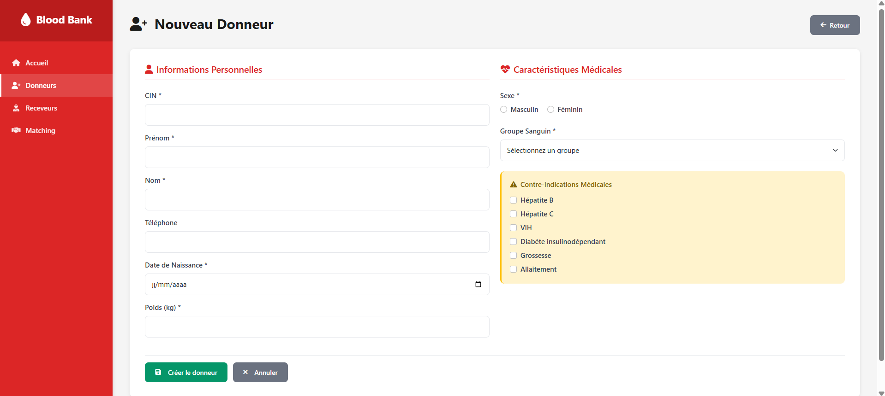
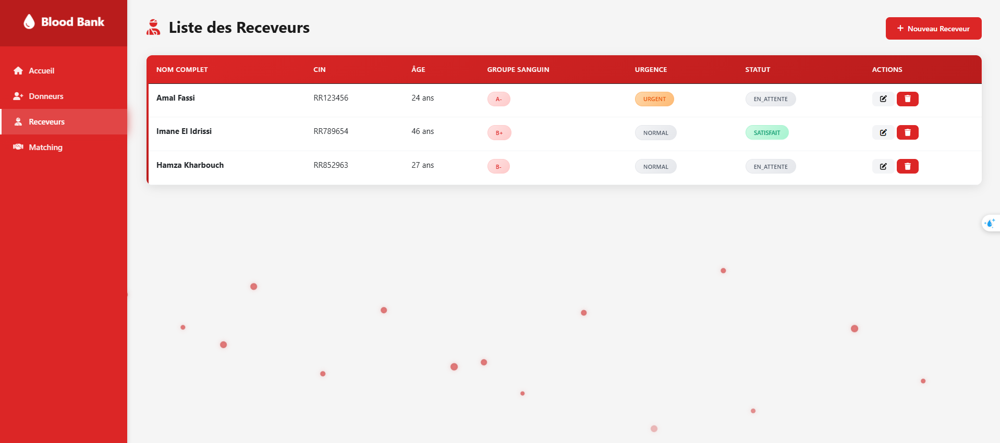
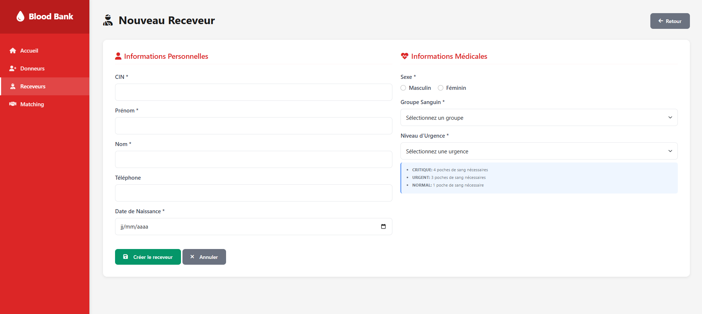
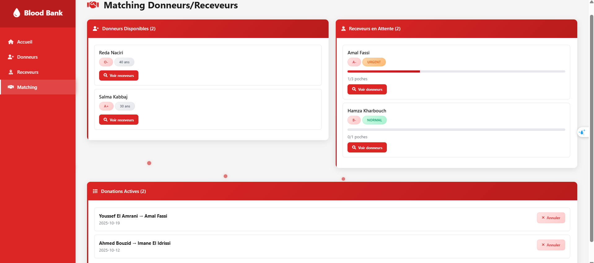
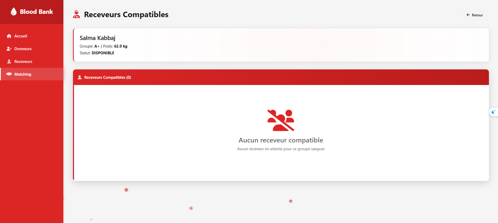
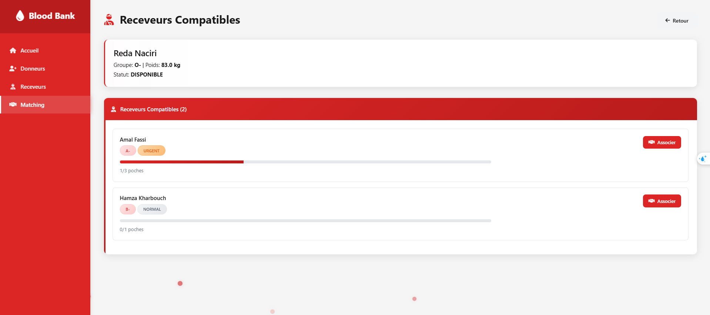
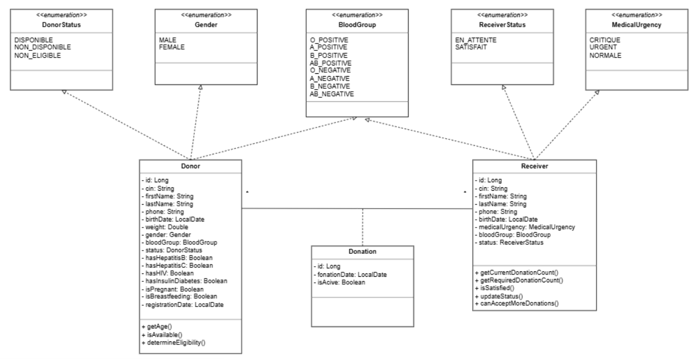

# 🩸 Système de Gestion de Banque de Sang

##🎯 Description du Projet

Ce projet consiste en une application web monolithique JEE pour la gestion complète d'une banque de sang. L'application permet de gérer les donneurs et receveurs de sang avec un système automatique de matching basé sur les compatibilités sanguines et les urgences médicales.

### Contexte
Suite aux défis rencontrés par les centres de transfusion sanguine dans la gestion manuelle des donneurs et receveurs, cette solution web moderne et efficace a été développée pour automatiser et optimiser le processus de gestion.

## ✨ Fonctionnalités

### 🎪 Pages Principales
- **Page d'accueil** : Vue d'ensemble du système
- **Gestion des Donneurs** : Création, modification, suppression et liste des donneurs
- **Gestion des Receveurs** : Création, modification, suppression et liste des receveurs
- **Matching Automatique** : Association intelligente donneurs/receveurs

### 🔧 Fonctionnalités Métier

#### Gestion des Donneurs
- Validation automatique de l'éligibilité (âge, poids, contre-indications médicales)
- Gestion des statuts (DISPONIBLE, NON_DISPONIBLE, NON_ELIGIBLE)
- Contrôle des contre-indications médicales
- Limitation à 1 poche de sang maximum par donneur

#### Gestion des Receveurs
- Classification par urgence médicale (CRITIQUE, URGENT, NORMAL)
- Calcul automatique des besoins en poches de sang
- Gestion des statuts (EN_ATTENTE, SATISFAIT)
- Tri automatique par priorité

#### Système de Matching
- Matrice de compatibilité sanguine intégrée
- O- : Donneur universel
- AB+ : Receveur universel
- Règles spécifiques pour les autres groupes
- Association automatique des entités compatibles

## 🛠 Technologies Utilisées

### Backend
- **Java 8+** : Langage de programmation principal
- **JEE** : Java Enterprise Edition
- **JSP/JSTL** : Pages dynamiques
- **Servlets** : Gestion des requêtes HTTP
- **JPA/Hibernate** : ORM et persistance des données
- **Maven** : Gestion des dépendances et build

### Frontend
- **HTML5/CSS3** : Structure et style
- **Bootstrap 5** : Framework CSS
- **Font Awesome** : Icones
- **JavaScript** : Interactivité

### Base de Données
- **MySQL/PostgreSQL** : Système de gestion de base de données

### Serveur
- **Apache Tomcat** : Conteneur web
- **JUnit** : Tests unitaires

## 🏗 Architecture du Projet

### 📁 Structure du Projet

```
+---src
|   +---main
|   |   +---java
|   |   |   \---com
|   |   |       \---bloodbank
|   |   |           +---controller
|   |   |           |       DonorServlet.java
|   |   |           |       HomeServlet.java
|   |   |           |       MatchingServlet.java
|   |   |           |       ReceiverServlet.java
|   |   |           |       
|   |   |           +---dao
|   |   |           |       DonationDAO.java
|   |   |           |       DonorDAO.java
|   |   |           |       GenericDAO.java
|   |   |           |       GenericDAOImpl.java
|   |   |           |       ReceiverDAO.java
|   |   |           |       
|   |   |           +---filter
|   |   |           |       CharacterEncodingFilter.java
|   |   |           |       
|   |   |           +---model
|   |   |           |       BloodGroup.java
|   |   |           |       Donation.java
|   |   |           |       Donor.java
|   |   |           |       DonorStatus.java
|   |   |           |       Gender.java
|   |   |           |       MedicalUrgency.java
|   |   |           |       Receiver.java
|   |   |           |       ReceiverStatus.java
|   |   |           |       
|   |   |           +---service
|   |   |           |       BloodCompatibilityService.java
|   |   |           |       DonationService.java
|   |   |           |       DonorService.java
|   |   |           |       ReceiverService.java
|   |   |           |       
|   |   |           \---util
|   |   |                   DatabaseTest.java
|   |   |                   JPAUtil.java
|   |   |                   
|   |   +---resources
|   |   |   |   config.properties
|   |   |   |   config.properties.example
|   |   |   |   
|   |   |   \---META-INF
|   |   |           persistence.xml
|   |   |           
|   |   \---webapp
|   |       |   index.jsp
|   |       |   
|   |       +---images
|   |       |       anirudh-UiwUtEqROEs-unsplash 1.svg
|   |       |       
|   |       \---WEB-INF
|   |           |   web.xml
|   |           |   
|   |           \---views
|   |               |   home.jsp
|   |               |   
|   |               +---donor
|   |               |       form.jsp
|   |               |       list.jsp
|   |               |       
|   |               +---matching
|   |               |       compatibleDonors.jsp
|   |               |       compatibleReceivers.jsp
|   |               |       list.jsp
|   |               |       matching.jsp
|   |               |       
|   |               \---receiver
|   |                       form.jsp
|   |                       list.jsp
|   |                       
|   \---test
|       \---java
|           \---com
|               \---bloodbank
|                   +---model
|                   |       DonorTest.java
|                   |       ReceiverTest.java
|                   |       
|                   \---service
|                           BloodCompatibilityServiceTest.java
|                           
```
### Flux de Données
1. **Requête HTTP** → Servlet
2. **Servlet** → Service Métier  
3. **Service** → Repository DAO
4. **DAO** → Database (Persistance)
5. **Database** → DAO (Récupération)
6. **DAO** → Service (Traitement)
7. **Service** → Servlet (Réponse)
8. **Servlet** → JSP (Affichage)

### Design Patterns Implémentés
- **Repository Pattern** : Abstraction de l'accès aux données
- **Singleton Pattern** : Gestion des ressources partagées
- **MVC Pattern** : Séparation des préoccupations
- **DAO Pattern** : Abstraction de la persistance

## 🚀 Installation et Déploiement

### Prérequis
- Java JDK 8 ou supérieur
- Apache Maven 3.6+
- Apache Tomcat 9+
- MySQL/PostgreSQL
- IDE (Eclipse, IntelliJ IDEA, ou NetBeans)

### Étapes d'Installation

1. **Cloner le projet**
   ```
   bash
   git clone [https://github.com/ichrakjaifra/blood-bank-management.git]
   cd blood-bank-system
```
2. **Configurer la base de données**

```
-- Créer la base de données
CREATE DATABASE blood_bank;

-- Le schéma sera créé automatiquement par Hibernate
```
3. **Configurer la connexion à la base de données**
- Copier le fichier config.properties.example vers config.properties
- Modifier les paramètres de connexion :

```
# config.properties
DB_URL=jdbc:postgresql://localhost:5432/bloodbank_db
DB_USER=votre_utilisateur
DB_PASSWORD=votre_mot_de_passe
```
4. **Configurer la persistence JPA**
- Le fichier src/main/resources/META-INF/persistence.xml est déjà configuré
- Il lit automatiquement les paramètres depuis config.properties

5. **Compiler le projet**
```
mvn clean compile
```
4. **Déployer sur Tomcat**
-Copier le fichier target/blood-bank.war dans le dossier webapps de Tomcat
-Démarrer le serveur Tomcat

5. **Accéder à l'application**
```
http://localhost:8080/blood-bank
```

## 📸 Captures d'Écran
### Page d'Accueil

### Liste des Donneurs

### Formulaire Donneur

### Liste des Receveurs

### Formulaire Receveur

### Matching Automatique

### Receveurs Compatibles



## Diagramme de Classe


### 🎯 Tableau de Bord JIRA
🔗 **[Accéder au projet sur JIRA](https://ichrakjaifra-1758033929972.atlassian.net/jira/software/c/projects/SDGBDS/boards/102?atlOrigin=eyJpIjoiMTAxZTQxNGRhMTM2NDQ3ZGFhNGFkNGYxNWM3ODE4OGEiLCJwIjoiaiJ9)**

